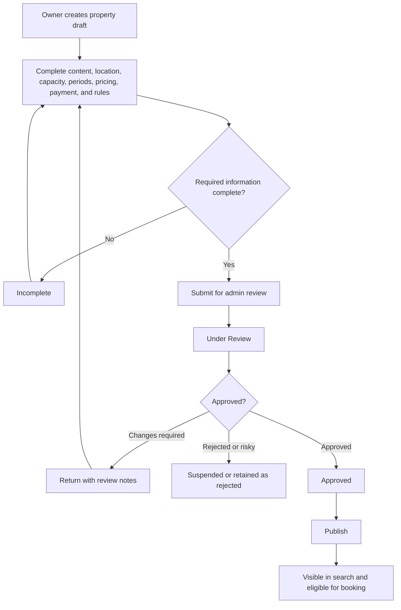
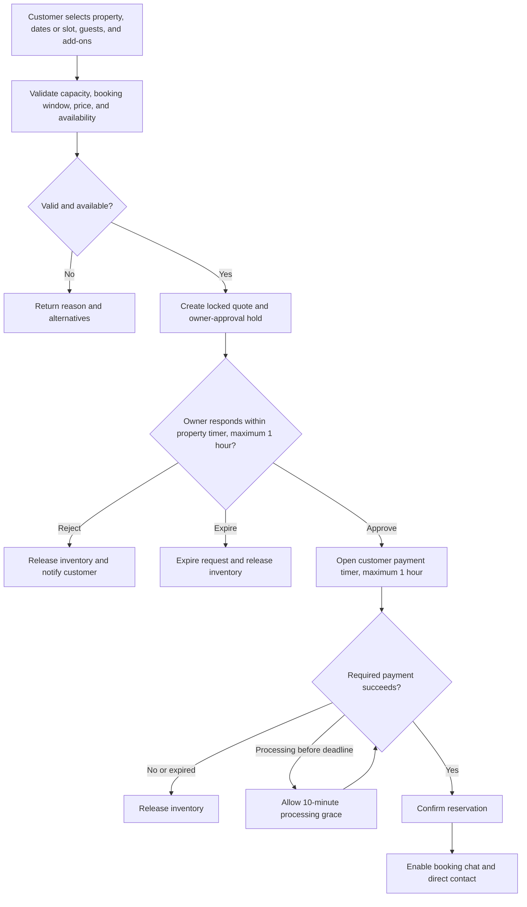
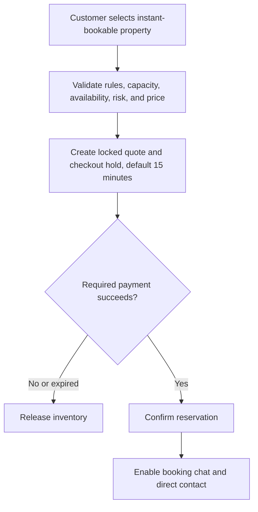
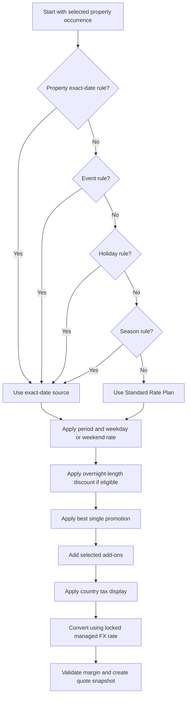
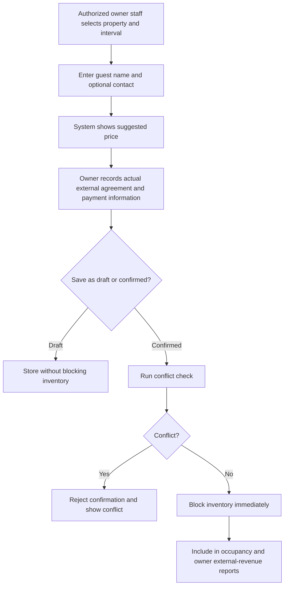
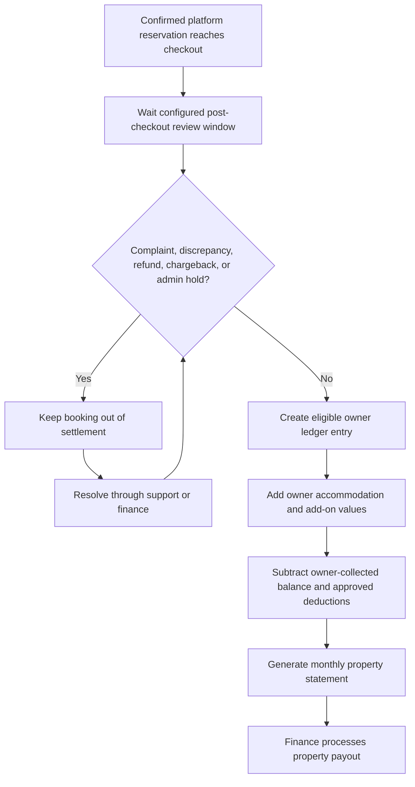
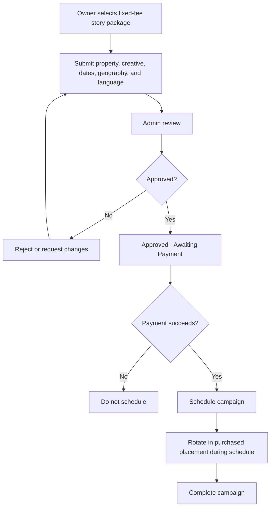

# Multi-Country Tourism Ecosystem

## Business and Product Feature Reference

**Version:** 1.0  
**Status:** Consolidated product baseline  
**Date:** 10 August 2026  
**Language:** English  
**Branding:** Brand-neutral. The legacy project name, logo, and visual identity are not part of this product definition.

---

## 1. Purpose of This Document

This document is the authoritative business and product reference for designing a new production-level, multi-country tourism ecosystem. It consolidates the confirmed requirements, operating rules, revenue models, user journeys, exception handling, and future expansion boundaries discussed during the product analysis.

This document is intended to be reused as context in future Codex conversations and during product implementation. Future work should treat the rules marked as confirmed as the current source of truth. Decisions in the `Business Decisions Still Required` section must not be silently invented or assumed.

This is not a technical architecture document. It describes what the ecosystem must do, who may do it, how the business rules behave, and how the major processes connect.

---

## 2. Product Vision

The product is a multi-country tourism marketplace that begins with a complete accommodation and villa-booking ecosystem and can later expand into additional tourism services.

The initial production product must support a large operational footprint, including approximately 100,000 daily users, multiple countries, multiple currencies, multiple languages, property owners, property staff, customers, administrators, advertisers, and support teams.

The long-term vision is broader than villa booking. Customers should eventually be able to discover and manage multiple tourism services through one branded ecosystem and one customer account. However, each service category must retain its own inventory, pricing, booking, payment, fulfillment, cancellation, and settlement rules.

### Confirmed strategic principles

- Accommodation is the first complete production marketplace.
- Villa booking and travel packages are separate business modules.
- Future restaurant, car-rental, tour, and agency services use separate orders and separate provider workflows.
- Future service orders may be linked into one customer trip timeline without being merged into one transaction.
- The platform is not limited to one city or one country.
- The customer may search and book properties in another country while planning travel.
- Country, city, property, and date context drive availability, pricing, legal settings, language, currency, tax, and operations.
- The production system is a new product, not a direct continuation of the POC data model or legacy branding.
- Customer website, PWA/mobile apps, owner panel/mobile app, and administrator panel are all part of the ecosystem experience.

---

## 3. Scope Baseline

### Initial production accommodation ecosystem

The initial production release includes the following business modules:

- Multi-country and multi-city market management.
- Customer accounts and profiles.
- Owner organizations, owner staff, and property-scoped permissions.
- Property onboarding, content, publication, and lifecycle management.
- Unified villa inventory and reservable-period management.
- Country, city, season, weekend, holiday, event, and property-specific pricing.
- Buy/sell, percentage-commission, and fixed-commission commercial agreements.
- Search, map discovery, filters, favorites, and property details.
- Rule-based personalized recommendations.
- Request-based booking and instant booking.
- Full and deposit-based payment policies.
- Owner calendars, manual reservations, and operational blocks.
- Owner-provided add-ons and property packages.
- Owner operational dashboards, reports, finance, and monthly settlements.
- Paid property stories and external-business banner advertising.
- Automatic promotions and promotion codes.
- Verified customer reviews with text and photos.
- Customer-owner messaging and direct contact after payment.
- In-app, push, and email notifications.
- Live in-app support and structured support cases.
- Administrative moderation, permissions, audit, risk controls, and reporting.

### Independently deferred capabilities

The following capabilities are not part of the initial production baseline and must be analyzed as separate future work:

- Automated cancellation and refund policy execution.
- Refundable property-damage deposits and damage-claim handling.
- External calendar and channel-manager synchronization.
- Travel-agency package ordering and fulfillment.
- Third-party restaurant ordering linked to a stay.
- Car-rental and other tourism-service orders.
- Customer price and availability alerts.
- Machine-learning recommendation models.
- Loyalty points, referrals, gift value, wallet credit, and customer membership offers.

---

## 4. Product Actors

| Actor | Business responsibility |
|---|---|
| Customer | Searches, books, pays, manages stays, selects add-ons, communicates, receives support, and submits verified reviews. |
| Owner organization | Commercial party responsible for one or more properties and their fulfillment. |
| Owner staff member | Operates assigned properties according to explicit property-scoped permissions. |
| Global administrator | Manages platform-wide markets, controls, financial settings, and cross-country operations. |
| Country or city administrator | Operates only within assigned geographic scope and explicit privileges. |
| Finance administrator | Manages commercial agreements, adjustments, settlements, payment exceptions, and financial reporting according to assigned privileges. |
| Content or moderation administrator | Reviews property content, advertisements, translations, reviews, and reported material. |
| Support administrator | Uses the admin view and read-only user mirror to assist customers and owners without impersonating them. |
| External advertiser | A restaurant, supermarket, rental agency, or other business purchasing fixed-fee banner placement through admin-managed sales. |
| Travel agency | Future provider of travel packages, tickets, hotel stays, tours, and vouchers through a separate module. |

---

## 5. Core Business Definitions

| Term | Definition |
|---|---|
| Property | A villa or similar accommodation unit listed in the marketplace. |
| Property inventory | The single physical property that can support only one overlapping active reservation or block. |
| Period template | A property-defined reservable time definition such as overnight, morning, evening, or full day. |
| Service date | The local property date on which a period starts and against which pricing calendar rules are evaluated. |
| Owner buy price | The contractual amount the platform owes the owner for the accommodation or service. |
| Platform sell price | The amount the platform chooses to charge the customer before tax and currency conversion rules are applied. |
| Locked quote | The complete price, availability, commercial, tax, currency, and policy snapshot accepted for a temporary booking hold. |
| Manual reservation | A booking received by the owner outside the platform and entered only to manage availability and owner records. |
| Calendar block | A non-customer interval such as maintenance, owner use, or administrative closure. |
| Platform booking | A reservation initiated and paid through the customer marketplace. |
| Settlement | The process that determines and pays the amount owed to an owner for eligible completed platform bookings. |
| Verified review | A review created by a customer after a completed platform reservation. |
| Sponsored placement | Paid property or external-business visibility displayed in a clearly labeled advertising area. |

---

## 6. Country, City, Language, Currency, and Market Control

### Market structure

- The platform operates as one global ecosystem with independently configurable country markets.
- Each property belongs to a city and country.
- Country defaults may apply to all cities unless a city-specific rule exists.
- City is the primary operating level for local season and event context.
- Property-specific approved exceptions may override broader market rules only where the pricing hierarchy allows them.
- Every country and city must have an operational timezone.
- Every reservation, price calendar entry, hold, check-in, checkout, and deadline uses the property timezone.

### Supported launch languages

- Arabic.
- English.
- Hebrew.
- Turkish.

### Language rules

- Administrators can enable or disable supported languages by market.
- The customer can select any language enabled for the market experience.
- A property owner may submit content in one supported source language.
- The platform creates or imports the remaining translations.
- Each translated property version requires administrative approval before publication.
- Missing or unapproved translations must not expose broken placeholders to customers.

### Supported launch currencies

- Israeli New Shekel, `ILS`.
- Jordanian Dinar, `JOD`.
- United States Dollar, `USD`.
- Turkish Lira, `TRY`.

### Currency rules

- Administrators can enable or disable customer payment currencies.
- Every property has exactly one settlement currency.
- Property buy prices, owner statements, and owner settlements use the property settlement currency.
- Customers may pay in any supported customer currency available for the country and payment method.
- The platform uses a managed customer sell rate rather than exposing the owner to currency conversion.
- The platform may include a configurable FX protection spread inside the conversion rate.
- The customer exchange rate is locked for checkout and stored in the booking snapshot.
- The platform carries exchange-rate risk between customer booking and owner settlement.
- Currency changes after confirmation do not change the contractual owner payable stored on the reservation.

### Country activation gate

A country must not accept live customer payments until administrators define the following:

- Enabled languages.
- Enabled customer currencies.
- Settlement currencies.
- Country timezone and city timezones.
- Weekend definition.
- Holiday sources or calendars.
- Tax display model.
- Applicable tax rules and rates.
- Customer invoice responsibility.
- Owner settlement requirements.
- Payment gateways and payment methods.
- Advertising package pricing.
- Customer and owner legal documents and policies.

---

## 7. Customer Accounts and Profiles

### Account access

- Public users may browse, search, view maps, and inspect property details without signing in.
- A customer must have an account before submitting a reservation request or paying for an instant booking.
- Customer account methods at launch are Google sign-in, Apple sign-in, and native account registration.
- Mobile OTP verification is not required at launch.
- Government ID or passport verification is not required at launch.
- Mobile verification may be added later.

### Customer profile

The customer profile supports the following:

- Full name.
- Preferred language.
- Preferred display and payment currency.
- Email address.
- Mobile number.
- WhatsApp number where applicable.
- Saved favorites.
- Upcoming, active, and historical bookings.
- Payment and invoice history.
- Booking chats.
- Support conversations and cases.
- Submitted reviews and review status.
- Personalization preference controls.

### Contact-data rule

- A platform booking must contain usable customer contact data before payment confirmation.
- Launch does not require OTP verification of the mobile number.
- Customer and owner direct contact details remain hidden before payment confirmation by default.
- An administrator may explicitly allow pre-confirmation contact for a property.
- After payment confirmation, both parties receive in-app messaging and direct phone or WhatsApp contact.

### Customer abuse controls

- The platform has a general configurable maximum for concurrent active booking requests per customer.
- The limit applies regardless of whether the requested periods overlap.
- Confirmed paid bookings do not count as temporary active requests.
- Repeated expiration of booking holds may trigger progressive cooldowns or a lower temporary request limit.
- Good behavior may automatically restore normal limits.
- An administrator may override restrictions with a recorded reason.

---

## 8. Owner Organizations and Staff

### Organization model

- An owner is an organization or operating entity, not only a single login.
- One owner organization may manage multiple properties.
- An owner organization may create multiple staff accounts.
- Staff permissions are assigned per property.
- Staff access follows least privilege and does not automatically include every organization property.

### Example owner permissions

- View assigned properties.
- View reservation requests.
- Approve or reject reservation requests.
- View customer contact after payment.
- Use booking chat.
- Create manual reservations.
- Confirm manual reservations.
- Create maintenance or owner-use blocks.
- Edit future manual reservations.
- Record owner-collected balances.
- View property reports.
- View settlement statements.
- Manage property content drafts.
- Submit price or property changes for approval.
- Manage owner-provided add-ons.
- Request paid story advertisements.

### Owner verification

- There is no universal mandatory owner KYC checklist in the confirmed initial scope.
- Owner verification and requested documents are subject to administrator discretion and country requirements.
- The product should still record verification status, checked items, reviewer, review time, notes, and uploaded evidence when administrators use them.
- A country may later define mandatory verification without changing the overall owner model.

### Owner control actions

- Administrators may suspend or hold an owner account.
- Administrators may suspend one property without suspending the entire organization.
- Owner cancellations, repeated non-response, complaints, fraud indicators, or policy violations may trigger administrative review.
- Owner performance is shown in admin reporting but does not automatically change search ranking or instant-booking eligibility.
- Any ranking or eligibility change caused by owner performance requires explicit admin action.

---

## 9. Property Onboarding, Content, and Lifecycle

### Property record

Each property supports at least the following business information:

- Owner organization.
- Country, city, area, and exact geographic coordinates.
- Property name and multilingual descriptions.
- Property type and status.
- Images, videos, and approved media.
- Facilities and amenity values.
- Bedrooms, beds, bathrooms, and other descriptive capacity information.
- One property-wide maximum guest capacity.
- Adults, children, and infants as separate reservation counts.
- Property rules and prohibited uses.
- Reservable period templates.
- Booking lead time and future-booking horizon.
- Check-in, access, and operating instructions.
- Payment policy.
- Commercial agreement.
- Cancellation-policy reference for display, even while automated execution is deferred.
- Nearby services, landmarks, and travel-distance information.
- Settlement currency.
- Instant-booking eligibility.
- Pre-confirmation contact permission.
- No-show and resale permissions.

### Location rules

- Exact property location is visible publicly on the customer website, app, and map.
- Search supports country, city, area, property name, and landmark context.
- Access codes and private arrival instructions are never treated as public location data.
- Access details are withheld until the required booking payment conditions are satisfied.

### Capacity rules

- Every property has one maximum capacity that applies to all reservable period templates.
- Customers declare adults, children, and infants separately.
- Country configuration defines age ranges for children and infants.
- The accommodation price remains fixed up to maximum property capacity.
- There is no extra-person accommodation charge in the confirmed model.
- Owner-provided add-ons may still charge per person.
- A booking that exceeds capacity cannot proceed.

### Publication lifecycle

| Status | Meaning |
|---|---|
| Draft | Property exists but is not ready for submission. |
| Incomplete | Required information or configuration is missing. |
| Submitted | Owner has submitted the property for review. |
| Under Review | An administrator is reviewing content and settings. |
| Changes Required | The property was returned with required corrections. |
| Approved | Business and content review are complete. |
| Published | Property is visible and eligible for search and booking. |
| Temporarily Unavailable | Property remains registered but cannot receive bookings. |
| Suspended | Administrator has disabled the property because of risk, policy, or operational issues. |
| Archived | Property is retained for history but is not operational. |

### Property approval rules

- Publication requires administrative review.
- Proof of ownership, management authority, licenses, or inspection is not universally mandatory in the confirmed baseline.
- Administrators may request documents or inspection based on country, property, or risk context.
- Sensitive property changes require administrative approval before becoming customer-visible.
- Routine manual reservations and calendar blocks take effect immediately when performed by authorized owner staff.
- Published settings used by an existing booking are snapshotted and do not retroactively change that booking.

---

## 10. Reservable Periods and Unified Inventory

### One inventory model

- A villa or property has inventory capacity of exactly one.
- Two active reservations, holds, or blocks may not overlap the same property interval.
- All availability sources use one conflict engine.
- Platform bookings, manual reservations, maintenance blocks, owner-use blocks, and admin blocks compete for the same inventory.

### Period templates

- A property defines its own available period templates.
- A period template has a local start time and local end time.
- An overnight template crosses into the following calendar date.
- Morning, evening, and full-day templates begin and end on one service date.
- Customer-facing labels such as Morning, Evening, Full Day, and Overnight describe the template but do not create separate inventory systems.
- Property period templates may overlap by definition, but only one overlapping occurrence can be booked.

### Date-range behavior

- Overnight is the only period type that supports a multi-date range in one reservation.
- An overnight range repeats the selected overnight template for consecutive service dates.
- Morning, evening, and full-day periods are single-date, single-template reservations.
- A customer cannot combine different property templates inside one villa reservation.

### Turnover buffers

- Administrators may configure preparation or cleaning buffers per property or period template.
- Buffers may apply before a reservation, after a reservation, or both.
- Buffer intervals participate in conflict detection.
- Customers see availability based on the complete blocked interval, not only the visible check-in and checkout times.
- Existing confirmed reservations retain the buffer assumptions stored in their booking snapshot.

### Booking-window controls

- Minimum booking notice is configured per property.
- Same-day booking eligibility is configured per property.
- Maximum future-booking horizon is configured per property.
- These settings require administrative approval.
- Search and quote results exclude periods outside the allowed booking window.

### External calendars

- Automatic synchronization with external calendars is not included in the initial production baseline.
- Owner-entered manual reservations and blocks are the initial method for recording off-platform occupancy.

---

## 11. Availability and Conflict Rules

### Availability sources that block inventory

- Pending owner-approval hold.
- Owner-approved payment hold.
- Instant-booking checkout hold.
- Payment-processing grace hold.
- Confirmed platform reservation.
- Confirmed manual reservation.
- Maintenance block.
- Owner personal-use block.
- Operational closure.
- Administrative block.

### Non-blocking records

- Draft manual reservation.
- Rejected booking request.
- Expired booking request.
- Failed quote without a hold.
- Cancelled record after its inventory is explicitly released.
- Historical completed reservation after the blocked interval ends.

### Conflict evaluation

- Conflict checks use actual timestamps in the property timezone.
- The effective conflict interval includes configured before and after buffers.
- Any overlap with an active blocking interval makes the requested occurrence unavailable.
- Conflict checks run when quoting, creating a hold, approving a request, starting payment, confirming payment, creating a manual reservation, and editing a future manual reservation.
- The final confirmation check must be transactional so two customers cannot confirm the same property interval.
- A property can have only one active blocking hold for the same overlapping inventory interval.

### Expiration behavior

- An expired temporary hold releases inventory automatically.
- A draft never reserves inventory.
- A confirmed reservation is never automatically released because the customer arrives late.
- An overdue remaining balance does not automatically release inventory in the initial release.

---

## 12. Pricing Calendar and Price Calculation

### Pricing objectives

The pricing model must support low season, high season, weekends, holidays, events, exact dates, period types, and overnight-length discounts while keeping owner contractual price and customer selling price separate.

### Geographic pricing responsibility

- Country configuration provides broad defaults.
- City is the primary calendar for local seasons and city-wide events.
- Property-specific approved exceptions handle localized demand or exact property circumstances.
- Owners may submit proposed buy-price changes.
- Administrators control approval and final platform selling prices.
- Privileged administrators may directly change approved property prices with an audit record.

### Calendar-source precedence

The price source for each occurrence follows this order:

1. Locked booking quote.
2. Property exact-date override.
3. Applicable event rule.
4. Applicable holiday rule.
5. Applicable season rule.
6. Property Standard Rate Plan.

### Calendar rules

- Weekend days are defined per country.
- Weekend is a day category, not a booking mode.
- Holidays may be country-wide or city-specific.
- Events are normally city-level and may have approved property-specific exceptions.
- Exact-date overrides belong to a property.
- Every pricing rule is effective-dated and auditable.
- Same-level overlapping rules must be rejected or assigned explicit priority before activation.
- The system must never silently choose an ambiguous pricing rule based only on creation time.

### No-season fallback

- Every property-period combination must have a Standard Rate Plan.
- If no season, event, holiday, or exact-date rule applies, the Standard Rate Plan is used.
- Missing seasonal configuration does not make a period free and does not make it unavailable if a valid standard price exists.

### Service-date rule

- Pricing uses the local date on which the period starts.
- An overnight period belongs to its check-in or start date for season, holiday, event, weekday, and weekend rules.
- Cross-midnight hours are not split between two calendar prices.

### Overnight length discount

- Length discounts apply only to overnight reservations.
- Discounts are configured as an amount deducted from each eligible night.
- Example ranges may include no discount for 1 to 2 nights, `-100` per night for 3 to 5 nights, and `-200` per night for 6 to 10 nights.
- Actual ranges and amounts are property settings approved by administrators.
- Ranges may not overlap.
- The system first calculates each night using exact date, event, holiday, season, weekend, and standard rules.
- The applicable length discount is then subtracted from each eligible night.
- Exact-date rules may explicitly disallow the length discount.
- Discount funding must be identified as platform-funded, owner-funded, shared, or campaign-funded.

### Occupancy pricing

- The villa accommodation price is fixed up to the property maximum capacity.
- Adults, children, and infants are collected for validation and reporting, not accommodation-price multiplication.
- Per-person owner add-ons remain allowed.

### Promotion calculation

- Automatic campaigns and promotion codes are evaluated after overnight-length discounts.
- Only the best single eligible campaign is applied.
- Campaign discounts do not stack.
- Tax and currency conversion are applied according to country display and checkout rules after the discount calculation.

### Customer quote order

The customer quote follows this business sequence:

1. Validate property and period availability.
2. Resolve the calendar price source for every occurrence.
3. Apply the period-template and day-category rate.
4. Apply the overnight-length discount when eligible.
5. Apply the best eligible campaign or promotion code.
6. Add selected owner-provided add-ons.
7. Add or identify taxes according to country configuration.
8. Convert into the selected customer currency using the managed checkout rate.
9. Validate margin and privileged negative-margin authorization.
10. Create a locked quote snapshot for the temporary hold.

### Starting-from price

- Date-free property cards show the minimum active price among the property period templates.
- The card must label this value as a starting or from price.
- A date-free price is indicative and is recalculated after the customer selects a service date or overnight range.
- A limited campaign price should not be used as the generic starting price unless the current customer and search context are eligible.

---

## 13. Platform Revenue and Commercial Agreements

### General rules

- Every property has one active, effective-dated commercial model.
- Existing bookings retain the commercial model and values snapshotted at confirmation.
- A property agreement may change for future bookings without changing historical bookings.
- The customer does not pay a separate platform service fee.
- Owner-provided add-ons have separate buy and sell values from accommodation.

### Model A: Buy/sell model

This is the standard commercial model.

- The owner supplies an approved contractual buy price.
- The platform independently defines the customer selling price.
- The platform may sell above the owner price.
- The platform may create offers below the normal selling price.
- A privileged administrator may approve a negative-margin sale.
- A platform-funded discount does not reduce the owner contractual payable.
- An owner-funded or shared discount changes owner payable only when that funding arrangement is explicitly approved and snapshotted.
- Platform margin is the eligible customer accommodation revenue minus the owner contractual accommodation value and applicable platform-funded reductions or costs.

### Model B: Percentage commission

- Commission is calculated on the customer net accommodation subtotal after discounts.
- Taxes are excluded from the commission basis.
- Refundable deposits are excluded from the commission basis.
- Payment-gateway fees are excluded from the commission basis.
- Separately priced add-ons are excluded because they have their own buy/sell model.
- The commission percentage is stored in the property agreement and snapshotted on the booking.

### Model C: Fixed commission

- One fixed property-currency commission amount applies per eligible completed reservation.
- The amount is snapshotted when the booking is confirmed.
- The commission becomes financially recognized when the completed booking enters settlement eligibility.
- Fixed commission is not multiplied by nights, days, or slots.

### Commercial controls

- Owners submit buy-price changes for administrative approval.
- Privileged administrators may directly change buy prices.
- Administrators control platform sell prices, promotions, and negative-margin authorization.
- Minimum permitted margin remains a business decision still required.
- All changes record previous value, new value, effective date, actor, reason, and scope.

### Advertising revenue

- Advertising is a separate platform-income source.
- Advertising uses fixed fees, not pay-per-view, pay-per-click, or pay-per-action billing.
- Property stories and external-business banners have separate package catalogs.

---

## 14. Search, Discovery, Map, and Ranking

### Search behavior

- Customers can search without dates.
- Customers can search all period types together.
- Search supports country, city, area, property name, and landmark.
- Selecting dates or a slot applies exact availability and price validation.
- Search results support overnight ranges and same-day period templates without forcing the customer to select a booking mode first.

### Core filters

- Country and city.
- Area or map bounds.
- Service date or overnight range.
- Adults, children, and infants.
- Price range.
- Property capacity.
- Facilities and amenities.
- Period availability.
- Instant-booking eligibility.
- Rating.
- Promotions or packages.
- Property rules where relevant.

### Map behavior

- Exact property locations are displayed.
- Moving the map automatically refreshes results after map movement stops.
- There is no required Search This Area button.
- Map results and list results use the same filters and availability rules.
- The visible map area affects the search query and result count.

### Organic ranking

- Organic ranking is weighted and explainable.
- Ranking may consider text or location relevance, selected-date availability, price relevance, review score, listing completeness, and customer filter match.
- Owner response and fulfillment performance appear in admin reports only.
- Owner performance does not automatically change organic ranking.
- Administrators may explicitly change eligibility or marketplace treatment when justified.
- Sponsored properties do not receive a hidden organic ranking boost.

### Sponsored discovery

- Sponsored properties appear only in dedicated, clearly labeled placements such as Stories, Featured, or Sponsored.
- Sponsored status must not be disguised as an organic recommendation.
- Advertising does not change organic-search scoring.

### Favorites

- Signed-in customers may save or remove favorite properties.
- Favorites may be used as a recommendation signal when personalization consent is active.
- Favorites do not reserve inventory or lock prices.

### Alerts

- Customer alerts for unavailable dates or price changes are not included in the initial production scope.
- Alerts may be considered later as part of the loyalty and engagement roadmap.

---

## 15. Personalized Recommendations

### Launch model

- Personalization is rule-based at launch.
- The platform records structured events so machine-learning models can be introduced later.
- Personalized recommendations appear in dedicated sections on the home experience and property details.
- Personalized recommendations do not rerank the core organic search results.
- Sponsored properties remain separate from personalized organic recommendations.

### Recommendation signals

- Search locations.
- Viewed properties.
- Saved favorites.
- Previous platform bookings.
- Preferred price ranges.
- Party size.
- Selected facilities.
- Period-type interest.
- City and country affinity.
- Similar-property behavior.

### Anonymous behavior

- Anonymous browsing behavior may be used for rule-based personalization by default.
- Enabled personalization session behavior may be merged into the customer profile after sign-in.
- Customers must be able to disable personalization and reset relevant preference history from their settings.
- Without sufficient signals, recommendations fall back to broadly popular, currently available, or editorially selected properties for the active country or city.

---

## 16. Booking Lifecycle

### Booking modes

- Request booking requires owner approval before customer payment.
- Instant booking skips owner approval and proceeds directly to payment.
- Instant-booking eligibility is controlled by administrators per property.
- Owners cannot independently enable instant booking.

### Request-booking flow

1. Customer selects property, service date or overnight range, guest counts, and optional add-ons.
2. Platform validates capacity, booking window, price, and availability.
3. Platform creates a locked quote and temporary inventory hold.
4. Owner receives the request and may approve or reject only the exact request.
5. Owner-approval waiting time is configured per property and may not exceed one hour.
6. Rejection immediately releases inventory.
7. Expiration releases inventory automatically.
8. Approval opens the customer payment window.
9. Customer payment waiting time is configured per property and may not exceed one hour.
10. Successful required initial payment confirms the reservation.

### Owner response rule

- An owner may approve or reject only.
- An owner cannot change customer price, dates, period template, guests, add-ons, or conditions as a counteroffer.
- Only an authorized administrator may revise a pending request.
- A material admin revision creates a new quote and requires customer acceptance.
- If the revision affects owner contractual terms or fulfillment, owner approval must be revalidated.

### Payment-processing grace

- If the customer starts payment before the payment deadline, a ten-minute processing grace may apply.
- The grace is only for an active payment attempt.
- Starting a payment attempt must not create an unlimited extension.
- A definitive payment failure releases the hold unless another allowed attempt remains within the original or grace window.

### Instant-booking flow

- The default instant checkout hold is 15 minutes.
- The value may be property-configurable within platform limits.
- Inventory remains held during valid checkout and payment processing.
- Successful required payment confirms the reservation.
- Expiration or definitive payment failure releases inventory.

### Customer concurrent requests

- Administrators configure a general maximum number of temporary active booking requests per customer.
- The rule applies across all requested dates and properties.
- The system refuses a new hold when the customer reaches the limit.
- Progressive abuse controls may temporarily reduce the allowed maximum.

### Reservation status model

| Status | Business meaning |
|---|---|
| Quote | Price and availability calculated but inventory not yet held. |
| Pending Owner Approval | Inventory is temporarily held while waiting for owner action. |
| Rejected | Owner or authorized admin rejected the request and inventory is released. |
| Owner Approved - Awaiting Payment | Owner approved and the customer payment timer is active. |
| Payment Processing | A valid payment attempt is being finalized. |
| Confirmed | Required initial payment succeeded. |
| Balance Due | Reservation remains confirmed but a remaining payment is required. |
| Active | Scheduled property period has started. |
| Completed | Scheduled period ended. |
| No-show Reported | Owner reported non-arrival after the start time. |
| On Hold | Administrative, complaint, payment, or settlement review is active. |
| Expired | Temporary owner or customer timer ended. |
| Cancelled Before Payment | Customer cancelled before payment and inventory is released. |
| Cancelled After Payment - Manual | Post-payment cancellation is being handled manually. |

### Check-in and arrival

- The reservation becomes Active automatically at the scheduled start time.
- Physical customer arrival is recorded separately.
- A customer may arrive at any time before the booked period ends unless property rules state otherwise.
- Late arrival does not automatically release inventory.
- Access details are released only after required payment conditions are satisfied.

### No-show handling

- The owner decides when to report a no-show after the scheduled start.
- Reporting a no-show does not automatically release inventory.
- Deposit-only no-show inventory may be reopened when the property is configured to allow owner-approved resale.
- A fully paid no-show requires administrator approval before inventory can be reopened.
- If the same period is resold, the original reservation's financial penalty is not automatically refunded or reduced.
- Detailed no-show compensation and refund policies remain manual until future policy automation is defined.

### Owner cancellation

- Owner cancellation of a confirmed reservation is an exception requiring administrative review.
- Customer compensation is decided manually by an authorized administrator in the initial release.
- Administrators may hold, suspend, or restrict the owner or property.
- Automated owner penalties are not defined in the confirmed baseline.

---

## 17. Payment Policies and Collection

### Property payment policy

- Every property has exactly one active payment policy.
- The same active policy applies to all property period templates and seasons.
- A new property defaults to full payment through the platform.
- An approved property may use a fixed booking deposit.
- An approved property may use a percentage booking deposit.
- Owners may submit payment-policy changes.
- Administrators approve or directly configure the final policy.

### Initial payment

- A reservation becomes Confirmed after the required initial payment succeeds.
- A percentage deposit applies to the final customer booking total after discounts.
- The deposit basis includes accommodation, selected add-ons, and configured taxes.
- Future refundable damage deposits are excluded from the booking-deposit basis.
- A fixed deposit cannot exceed the final amount due; when it does, the required initial payment becomes the full amount.

### Remaining balance

- The default remaining-balance due point is check-in.
- When the platform collects the balance, it prompts the customer in a configurable pre-check-in window.
- Access details remain withheld until the platform-collected balance succeeds.
- The reservation remains confirmed while the balance is pending.
- An overdue balance becomes a manual exception.
- The system alerts the customer, owner, and administrators.
- The system does not automatically cancel or release inventory because of an overdue balance in the initial release.

### Collection responsibility

- Platform collection is the default.
- Owner collection of the remaining balance requires administrative approval per property.
- Authorized owner staff records the collected amount, method, time, and reference.
- Owner-confirmed collection creates a settlement offset against the amount otherwise payable to the owner.
- The system never assumes owner collection automatically at check-in.

### Country payment routing

- Administrators enable payment gateways and payment methods per country and currency.
- A country may have multiple gateway routes.
- Gateway priority and fallback are centrally controlled.
- Owners do not choose the platform payment gateway.
- Gateway callbacks and payment status must be reconciled before confirmation.

### Failed and uncertain payments

- A definitive failure does not confirm the reservation.
- An uncertain or delayed gateway state remains Payment Processing only within the allowed grace behavior.
- Duplicate successful gateway events must not create duplicate charges or duplicate reservations.
- Support and finance users require a reconciliation view for inconsistent gateway states.

### Gateway fees and refunds

- The platform absorbs nonrefundable gateway fees for platform bookings.
- Automated post-payment cancellation and refund handling is deferred.
- Initial-release post-payment refunds are handled manually by authorized administrators and gateway capabilities.
- Damage deposits are not part of the initial release.

### Taxes and invoices

- Tax display may be inclusive or exclusive according to country configuration.
- Applicable tax rates and invoice responsibility must be configured before live payments.
- Tax must appear clearly in the customer quote, checkout, receipt, and invoice.
- The platform must not label an undecided tax as final or legally compliant.

---

## 18. Owner Calendar, Manual Reservations, and Blocks

### Unified owner calendar

The owner calendar shows all property occupancy sources in one timeline:

- Pending platform holds.
- Awaiting-payment holds.
- Confirmed platform bookings.
- Manual reservations.
- Maintenance blocks.
- Owner-use blocks.
- Operational closures.
- Administrative blocks.

### Manual reservation purpose

A manual reservation represents an off-platform agreement received through phone, WhatsApp, social media, walk-in, returning customer, travel agent, or another external source.

### Manual reservation rules

- Manual reservations are commission-free.
- Payment is collected outside the platform.
- The platform payment gateway is not used.
- The owner may record the externally agreed total, paid amount, remaining amount, method, and notes.
- The system shows a comparable suggested property price.
- The owner may override the suggested price to record the actual agreement.
- Suggested price and actual external price remain separately reportable.
- Guest name is required.
- Mobile, email, and platform-account link are optional.
- The source channel is recorded for reporting.
- Manual reservations cannot generate verified customer reviews.
- Manual reservations do not create platform commission or platform settlement entries.

### Draft and confirmation

- Draft manual reservations do not block inventory.
- Authorized staff with confirmation permission may save a manual reservation as confirmed.
- Confirmed save immediately blocks inventory after conflict validation.
- Staff without confirmation permission may prepare a draft only.

### Editing and cancellation

- Authorized owner staff may edit future manual reservations.
- Every date or time edit reruns conflict detection.
- Started or completed manual reservations require an administrator correction.
- Records are cancelled or deactivated with history rather than hard deleted.
- Manual reservation changes record actor, time, old value, new value, and reason.

### Operational blocks

- A block has a property, type, start, end, reason, creator, and status.
- Blocks have no customer, price, commission, payment, or settlement.
- Typical block types are Maintenance, Owner Use, Operational Closure, and Admin Hold.
- Blocks use the same turnover and overlap rules as reservations.

### Reporting treatment

- Manual reservations contribute to occupancy reports.
- Owners may record external revenue for their own reports.
- Platform and manual revenue remain separable by source.
- Administrators may view combined occupancy without treating manual value as platform GMV or platform revenue.

---

## 19. Owner-Provided Add-ons and Property Packages

### Add-on purpose

Owners may offer services directly connected to a property stay, including food, dinner, photography, event setup, decorations, cleaning, transport arranged by the owner, or similar property-managed services.

### Add-on pricing units

An add-on may be priced using one configured unit:

- Per booking.
- Per person.
- Per quantity.
- Per booked period.

### Add-on rules

- Each add-on has multilingual content, eligibility, lead time, minimum quantity, maximum quantity, and fulfillment instructions.
- The owner must publish only services that can be guaranteed under the configured rules.
- Selected add-ons confirm with the villa reservation.
- Add-ons do not wait for a separate owner approval.
- Instant booking remains possible when its selected add-ons satisfy lead-time and quantity rules.
- Unavailable or invalid add-ons are removed from selection before the customer creates a hold.

### Add-on commercial model

- Every add-on stores an owner buy value and a platform sell value.
- Values are snapshotted with the reservation.
- Add-on customer value is included in the same checkout.
- Add-on owner value is included in the same property settlement.
- Add-on margin is reported separately from accommodation margin.
- Accommodation percentage or fixed commission does not automatically apply to separately priced add-ons.

### Property packages

- A property package may combine one reservable property period with one or more guaranteed owner add-ons.
- The package may present a combined customer offer while preserving component buy values internally.
- Package availability depends on both property availability and add-on eligibility.
- The customer may select a package or eligible add-ons according to the configured offer.

### Scope boundary

- Owner-provided add-ons are fulfilled by the villa owner organization.
- Future restaurants, car-rental agencies, photographers, or other independent businesses are not modeled as owner add-ons.
- Third-party providers receive separate provider, inventory, order, payment, and settlement modules.

---

## 20. Owner Panel and Mobile Experience

### Core owner capabilities

- Portfolio dashboard across assigned properties.
- Property selector and property-scoped access.
- New reservation requests and countdowns.
- Approve or reject request actions.
- Upcoming, active, completed, rejected, expired, and no-show reservations.
- Unified availability calendar.
- Manual reservation creation and editing.
- Maintenance and owner-use blocks.
- Customer contact and booking chat after payment.
- Property content and translation status.
- Price and property-change submissions.
- Add-on and package management.
- Story-advertisement requests and payment status.
- Notifications and operational tasks.
- Reports, charts, financial values, and settlement statements.
- Live support and structured support cases.

### Owner financial visibility

- The owner sees the customer booking total.
- The owner sees the owner contractual payable separately.
- The owner does not need a platform-margin KPI label.
- Manual and platform revenue may be viewed separately or combined through filters.
- Manual external revenue is never presented as platform-collected revenue.

### Owner reports

- Occupancy by property and period.
- Platform bookings versus manual reservations.
- Request approval, rejection, and expiration counts.
- Confirmed, active, completed, and no-show counts.
- Customer booking value.
- Owner contractual value.
- Add-on sales and owner add-on value.
- Platform-collected and owner-collected balances.
- Settlement eligibility and statement history.
- Story-advertising spend.
- Review score and review status.

---

## 21. Owner Settlements and Financial Ledger

### Settlement grouping

- Settlement statements are generated per property.
- An owner with multiple properties receives separate statements for each property.
- Statements use the property settlement currency.
- Monthly settlement is the initial standard cadence.

### Settlement eligibility

- A platform booking becomes potentially eligible after scheduled checkout.
- A configurable post-checkout review window must end before settlement eligibility.
- An active complaint, support case, payment discrepancy, refund, chargeback, or admin hold pauses eligibility.
- A booking held in one property statement does not automatically block unrelated property statements.

### Buy/sell settlement

- Owner payable uses the approved buy values snapshotted on the booking.
- Platform selling-price changes do not retroactively change owner payable.
- Platform-funded negative-margin promotions do not reduce owner payable.
- Approved owner-funded reductions affect owner payable only when stored in the booking snapshot.

### Percentage and fixed commission settlement

- Percentage commission uses the eligible discounted accommodation subtotal, excluding taxes and add-ons.
- Fixed commission uses one snapshotted amount per eligible completed booking.
- Commission is recognized when the booking becomes settlement-eligible.

### Owner-collected balance offset

- Customer money collected by the owner is recorded against the reservation.
- The recorded amount reduces the amount otherwise payable by the platform to the owner.
- If owner collection exceeds the owner payable, the ledger must show an amount receivable from the owner or another approved adjustment.

### Settlement calculation concept

`Property settlement payable = eligible owner accommodation values + eligible owner add-on values + approved credits - owner-collected customer amounts - approved deductions`

### Statement contents

- Statement period and property.
- Opening balance where applicable.
- Eligible booking list.
- Customer booking values.
- Owner contractual values.
- Add-on owner values.
- Owner-collected offsets.
- Holds and excluded bookings.
- Approved adjustments.
- Final payable amount.
- Currency.
- Statement and payout status.

### Owner interaction

- Owner statements are read-only.
- There is no statement-acceptance or statement-dispute action.
- An owner may contact live support or open a general support case referencing the statement.
- Finance administrators handle any correction through an audited adjustment.

### Manual reservation exclusion

- Manual reservations do not enter the platform settlement ledger.
- Manual values may appear in owner-only external revenue reports.
- Manual values are excluded from platform GMV, commission, and payout calculations.

---

## 22. Fixed-Fee Advertising

### Advertising principles

- Advertising fees are fixed and transparent.
- Advertising is not billed by views, clicks, leads, or actions.
- Packages define placement, duration, geography, language, creative rules, and fee.
- Performance analytics may be recorded for information but never change the contracted fee.

### Product A: Paid property stories

- An owner requests a story package for an eligible property.
- Packages may offer durations such as one day, three days, or another admin-defined period.
- The owner selects available package attributes and submits the creative.
- An administrator reviews the property, creative, placement, dates, geography, and language.
- If approved, the campaign becomes Approved - Awaiting Payment.
- The owner pays the fixed fee.
- Successful payment changes the campaign to Scheduled.
- The story becomes Active at the scheduled start and Completed at the scheduled end.
- Rejection occurs before payment and records a reason.

### Product B: External-business banners

- External advertisers may include restaurants, supermarkets, car-rental agencies, attractions, and other businesses.
- The advertiser does not need to be a registered tourism-service provider.
- External advertising sales are admin-managed at launch.
- Staff creates the advertiser, campaign, creative, placement, schedule, invoice, and payment record.
- There is no external advertiser self-service portal in the initial release.

### Rotation model

- Advertising placement uses unlimited rotation rather than capacity-limited inventory.
- All active campaigns eligible for a placement rotate within that placement.
- A package buys scheduled presence, not a guaranteed number of impressions.
- The package description must disclose rotation clearly.
- Administrators may pause package sales to protect experience quality even though the system does not enforce a fixed active-slot limit.

### Targeting and pricing

- Packages may be priced by placement.
- Packages may be priced by duration.
- Packages may be priced by country or city.
- Packages may be priced by supported language.
- Targeting remains package-based and does not create usage-based fees.

### Advertising statuses

| Status | Meaning |
|---|---|
| Draft | Campaign is being prepared. |
| Submitted | Campaign awaits review. |
| Changes Required | Creative or setup must be corrected. |
| Rejected | Campaign was not approved. |
| Approved - Awaiting Payment | Campaign may proceed after fixed-fee payment. |
| Scheduled | Approved and paid with a future start. |
| Active | Campaign is currently rotating. |
| Paused | Administrator temporarily stopped delivery. |
| Completed | Purchased schedule ended. |
| Cancelled | Campaign ended before normal completion with an audited reason. |

### Advertising reporting

- Fixed revenue by package, placement, country, city, language, and customer type.
- Scheduled and active campaign counts.
- Owner property-story spending.
- External advertiser revenue.
- Informational views and clicks where tracked.
- Creative rejection and change-request rates.
- Campaign delivery failures and manual remedies.

---

## 23. Promotions and Offers

### Supported offer types

- Automatic eligibility-based campaigns.
- Customer-entered promotion codes.
- Fixed-amount discounts.
- Percentage discounts.
- Property-scoped offers.
- City or country campaigns.
- Audience-scoped campaigns.
- Date-scoped campaigns.

### Promotion control

- Only administrators create, approve, activate, pause, and end promotions.
- Owners do not create or publish promotions.
- A campaign records eligibility, dates, properties, audience, budget where relevant, discount type, discount value, and funding source.
- Funding source is Platform, Owner, Shared, or Campaign Budget.
- Owner-funded reductions require approved contractual treatment.

### Stacking rule

- Overnight-length discount is calculated before campaign evaluation.
- The platform evaluates all eligible automatic campaigns and promotion codes.
- The customer receives the best single eligible campaign.
- Campaigns do not stack with one another.
- The applied campaign and rejected alternatives are recorded for explainability.

### Margin control

- Every campaign quote passes the configured margin validation.
- A privileged administrator may authorize intentional negative margin.
- Negative-margin authorization records actor, reason, campaign, expected cost, and effective scope.
- The minimum normal margin remains a business decision still required.

---

## 24. Verified Reviews

### Eligibility

- Only a completed platform reservation can create a verified review.
- Manual reservations cannot create verified reviews.
- One reservation permits one customer review.
- Review eligibility starts after checkout and ends after an admin-configured review period.
- Reviews remain attached to the property even if ownership changes.

### Review content

- Overall rating.
- Cleanliness rating.
- Accuracy rating.
- Location rating.
- Value rating.
- Facilities rating.
- Check-in experience rating.
- Written review.
- Customer-uploaded photos.

### Moderation

- Every review requires administrator approval before publication.
- Reviews enter a moderation queue after submission.
- Administrators may approve, reject, request internal escalation, hide, or remove according to privileges.
- Rejection or removal records a reason.
- Photos require privacy and inappropriate-content checks.
- Owners may report a published review.
- Owners may post one public response.
- Owners cannot edit the customer review.

### Scale requirement

- Manual approval requires moderation queues, assignment, filters, status, aging, and workload reports.
- Automated validation may flag duplicates, personal data, abuse, or prohibited content but does not replace mandatory admin approval in the confirmed model.

---

## 25. Customer-Owner Communication

### Before payment

- Direct customer-owner contact is hidden by default.
- Pre-confirmation contact may be enabled only by an administrator for a property.
- The platform should not expose contact details in property content or images as a workaround.

### After payment confirmation

- Customer and owner receive access to an in-app booking chat.
- Customer and owner receive direct phone and WhatsApp contact details.
- Booking chat is linked to the reservation.
- Chat participants, timestamps, attachments, and moderation actions are auditable.
- Private access codes remain controlled separately from general contact details.

### Chat lifecycle

- Booking chat stays open through a configurable post-checkout review window.
- After the window, the chat becomes read-only.
- Administrators may preserve or restrict access because of a support case or legal requirement.
- A closed booking chat does not prevent either party from contacting platform support.

---

## 26. Notifications

### Launch channels

- In-app notifications.
- Push notifications.
- Email notifications.

### Deferred channels

- Official transactional WhatsApp messaging.
- SMS or mobile OTP messaging.

### Critical events

- New reservation request for owner.
- Owner-approval deadline reminders.
- Request approved or rejected.
- Customer payment deadline reminders.
- Payment success, failure, or pending status.
- Booking confirmation.
- Remaining balance due.
- Access details available or withheld.
- Check-in and checkout reminders.
- New booking-chat message.
- Manual support or admin action.
- Review invitation and review moderation result.
- Story-ad approval, payment, activation, and completion.
- Settlement statement issued or payout status changed.

### Delivery rules

- In-app notification history is the persistent customer or owner reference.
- Push and email delivery failures do not change booking state.
- Critical deadline events require retry and operational visibility.
- Message content uses the recipient language and property timezone.
- Sensitive access information must not be exposed in insecure notification previews.

---

## 27. Support, Live Chat, and Cases

### Support model

- Customers and owners can use live in-app support chat.
- Issues requiring follow-up become structured support cases.
- A live chat transcript may be attached to a case.
- Cases preserve ownership, assignment, status, history, attachments, and resolution.

### Case linkage

A support case may link to one or more of the following:

- Booking.
- Payment.
- Property.
- Owner organization.
- Customer account.
- Review.
- Advertisement.
- Promotion.
- Settlement statement.
- Notification or communication issue.

### Example case categories

- Booking assistance.
- Payment discrepancy.
- Remaining balance.
- Access or check-in issue.
- Property complaint.
- Owner complaint.
- Post-payment cancellation or refund request.
- Review moderation question.
- Advertising delivery issue.
- Settlement correction request.
- Account access or safety concern.

### Support administration

- Support staff use normal admin records and a read-only mirror of customer or owner views.
- Support staff do not impersonate users.
- Support users cannot perform financial or sensitive actions unless they separately hold the required privilege.
- Case resolution records actions, notes, evidence, customer communication, and final outcome.

---

## 28. Administration, Permissions, and Audit

### Administration model

- The platform has global administrators and geographically scoped administrators.
- An administrator may be scoped by country, city, owner, property, or another approved operating boundary.
- Permissions are assigned individually.
- There are no mandatory role templates in the confirmed baseline.
- A permission never grants access outside the administrator data scope.

### Sensitive actions

Examples include the following:

- Change owner buy price.
- Change platform sell price.
- Authorize negative margin.
- Approve or suspend a property.
- Enable instant booking.
- Change payment policy.
- Record financial adjustment.
- Release or hold settlement.
- Process manual refund.
- Suspend owner or customer.
- Approve review or advertisement.
- Change tax, currency, FX, holiday, season, or country configuration.

### Approval model

- One administrator with the required privilege may complete a sensitive action.
- Dual control or maker-checker approval is not required in the confirmed model.
- The absence of dual control requires strong compensating controls.

### Compensating controls

- Mandatory reason for sensitive actions.
- Complete before-and-after values.
- Immutable timestamp and administrator identity.
- Geographic and data scope validation.
- Step-up authentication for high-risk actions.
- Risk alerts for unusual financial or permission activity.
- Searchable audit history.
- No hard deletion of financial, booking, pricing, or moderation history.

### Support view

- Support receives a read-only mirror of the user experience.
- The mirror clearly identifies that it is an admin support view.
- No user session is created and no action is performed as the user.

---

## 29. Risk and Abuse Management

### Booking and payment risk

- Configurable risk rules evaluate customer, account, booking, property, payment, and behavior signals.
- A risk result may allow, require admin review, request another payment method, or decline.
- The decision and reason are auditable.
- Gateway fraud decisions are one signal and do not replace platform risk controls.

### Customer behavior risk

- Concurrent temporary booking requests are limited.
- Repeated hold expiration may trigger progressive restrictions.
- Suspicious account creation, unusual booking patterns, or repeated payment failures may trigger review.
- Customers may be suspended or restricted by privileged administrators.

### Owner risk

- Owner non-response, rejection rate, owner cancellation, complaints, review score, and fulfillment issues appear in admin reports.
- These metrics do not automatically change search ranking.
- These metrics do not automatically remove instant-booking eligibility.
- An administrator explicitly decides any suspension, hold, or marketplace restriction.

### Financial risk

- Owner-collected balances are settlement offsets.
- Negative-margin campaigns require explicit privilege.
- Payment discrepancies and chargebacks hold affected settlement entries.
- Large or unusual manual financial adjustments generate alerts.

---

## 30. Reporting and Business Intelligence

### Platform executive reporting

- Customer registrations and active users.
- Searches and zero-result searches.
- Property views and favorite saves.
- Quote-to-hold conversion.
- Hold-to-owner-approval conversion.
- Approval-to-payment conversion.
- Payment success rate.
- Confirmed booking value.
- Accommodation GMV.
- Platform revenue by commercial model.
- Buy/sell margin.
- Percentage and fixed commission revenue.
- Add-on sales and margin.
- Advertising revenue.
- Occupancy by country, city, property, season, and period.
- Manual versus platform occupancy.
- Settlement amounts and aging.
- Support volume and resolution.
- Review volume and moderation aging.

### Pricing and revenue reporting

- Standard, season, event, holiday, and exact-date revenue.
- Weekend versus weekday performance.
- Overnight-length discount cost and conversion.
- Promotion utilization and funding source.
- Positive, zero, and negative-margin reservations.
- FX gains or losses between booking and settlement.
- Gateway fees absorbed by the platform.

### Owner operational reporting

- Reservation volume and status.
- Occupancy calendar.
- Platform versus manual booking source.
- Customer total and owner payable.
- Owner-collected balance.
- Add-on performance.
- Settlement statements.
- Review results.
- Story-ad spend and status.

### Advertising reporting

- Fixed package revenue.
- Property story revenue.
- External banner revenue.
- Active campaign distribution by placement and market.
- Informational impressions and clicks where tracked.
- Campaign review and delivery issues.

### Data separation rules

- Manual reservation value is excluded from platform GMV and platform revenue.
- Sponsored visibility is excluded from organic-ranking analytics.
- Owner buy value and customer sale value remain separate.
- Tax, refundable liabilities, and customer payments are not reported as platform revenue unless accounting rules define them as such.

---

## 31. Future Tourism Modules

### Shared ecosystem services

Future tourism modules share the following platform capabilities:

- Brand and customer account.
- Language and currency preferences.
- Country and city discovery context.
- Notification center.
- Support and cases.
- Trip timeline.
- Common trust, moderation, and audit principles.

### Separation rule

- Every tourism module has independent inventory.
- Every tourism module has independent order status.
- Every tourism module has independent payment and settlement.
- Every tourism module has independent cancellation and refund policy.
- One provider's failure does not automatically cancel another provider's order.
- A villa and another service may be linked in the trip timeline without becoming one combined checkout.

### Travel-agency packages

- Travel packages are a later independent module.
- Agency inventory is not villa inventory.
- Packages may include travel tickets, hotel stays, tours, transport, or other itinerary items.
- Initial package requests require agency confirmation.
- The agency is responsible for issuing tickets and vouchers.
- Agency commercial agreements, customer payment, settlement, invoice responsibility, and cancellation require separate analysis.

### Third-party restaurants

- A future restaurant order may reference a confirmed villa booking for delivery place and timing.
- Restaurant menu, availability, preparation, delivery, payment, and settlement remain a separate order.
- The villa owner is not responsible for third-party restaurant fulfillment unless a distinct agreement says otherwise.

### Car rental and other services

- Car-rental inventory, pickup, return, driver, insurance, and deposit rules require a dedicated module.
- Photography, attractions, tours, and transportation from independent providers also require provider-specific order models.

### Customer trip timeline

- Separate confirmed orders may appear in one chronological trip view.
- Linking does not merge financial responsibility or cancellation behavior.
- Customers can see which provider is responsible for each order.

---

## 32. Deferred Growth Features

### Loyalty and engagement suite

- Loyalty points.
- Referral rewards.
- Gift cards or gift value.
- Wallet credit.
- Customer membership offers.
- Price-change alerts.
- Availability alerts.

### Deferred operational modules

- Automated cancellation policy templates.
- Automated refund calculation and gateway execution.
- Refundable damage deposits.
- Damage claims and evidence workflow.
- External calendar synchronization.
- Channel-manager integration.
- Machine-learning recommendations.

### Scope rule

Deferred features must not be partially simulated in the initial release in a way that creates a false customer promise. Manual exception handling must be clearly labeled and operationally supported until a complete future module is approved.

---

## 33. Main Process Flows

### 33.1 Property onboarding and publication

### 33.2 Request booking

### 33.3 Instant booking

### 33.4 Price calculation

### 33.5 Manual reservation

### 33.6 Settlement

### 33.7 Property story advertisement

---

## 34. Cross-Module Invariants

The following rules apply across the complete ecosystem:

- Existing confirmed bookings always use immutable commercial and policy snapshots.
- No customer-facing price is final until availability, pricing, tax, currency, and margin checks succeed.
- One property cannot have overlapping active inventory commitments.
- Manual reservations remain financially separate from platform bookings.
- Sponsored content remains visibly separate from organic and personalized content.
- Property owner buy value remains separate from customer selling value.
- Add-on values remain separate from accommodation values.
- Country legal, tax, invoice, currency, and gateway configuration gates live operation.
- Sensitive actions require explicit privilege, data scope, reason, and audit history.
- Records with financial, booking, pricing, moderation, or audit value are not hard deleted.
- Deferred automation is handled through transparent manual cases, not hidden or incomplete automation.
- Future tourism modules share the ecosystem but do not reuse villa booking logic where their inventory model differs.

---

## 35. Business Decisions Still Required

The following items are intentionally unresolved. A future product decision must update this reference before implementation assumes a final rule.

| Decision area | Required decision | Safe product gate until decided |
|---|---|---|
| First operating markets | Exact countries and cities for first production operation. | Configure markets but do not enable live booking until country activation is complete. |
| Taxes | Tax rates, collection responsibility, remittance responsibility, and invoice issuer in each country. | Disable live payment in a country until configured and legally reviewed. |
| Payment providers | Exact gateway providers and supported methods per country and currency. | Keep routing configurable and enable only tested routes. |
| FX management | Reference-rate source, update frequency, protection spread, and checkout lock duration. | Use admin-controlled rates and prevent stale-rate checkout. |
| Minimum margin | Normal minimum margin and thresholds for privileged negative-margin authorization. | Require explicit privileged approval whenever the configured floor is breached. |
| Customer native registration | Email verification, password recovery, and account-merging policy. | Do not assume mobile OTP or government-ID verification. |
| Age definitions | Child and infant age ranges and whether infants count toward property capacity. | Store separate counts and configure by country before launch. |
| Booking timers | Allowed property-specific defaults below the one-hour owner and payment maximums. | Enforce platform maximums and require valid property settings. |
| Post-checkout review window | Default and allowed range before settlement eligibility and chat closure. | Keep values country or property configurable. |
| Settlement operations | Monthly cutoff date, payout method, banking requirements, and failed-payout handling. | Generate statements but do not mark paid without finance confirmation. |
| No-show finance | Exact retained amount, owner payable, and customer remedy for each payment policy. | Handle through an audited manual support and finance case. |
| Access release | Exact timing and content of property access instructions. | Release only after required payment and approved operational conditions. |
| Cancellation and refunds | Policy templates, calculation, approval, customer refund, owner penalty, and gateway execution. | Allow pre-payment cancellation; handle post-payment cases manually. |
| Damage deposits | Collection timing, preauthorization, claims, evidence, release, and settlement impact. | Exclude damage deposits from the initial release. |
| External calendars | Providers, conflict priority, sync frequency, and failure handling. | Use manual reservations and blocks. |
| Owner verification | Country-specific documents, inspections, payout checks, and mandatory publication requirements. | Use administrator discretion and record review evidence. |
| Property rules | Standard policy templates and country-specific prohibited-use requirements. | Require admin-approved property rules before publication. |
| Advertising catalog | Exact placements, durations, fees, languages, and geographic packages. | Admin must create and activate each package before sale. |
| Advertising remedies | Remedy when an active campaign is not delivered as scheduled. | Handle extension, credit, or refund through an audited admin case. |
| Moderation operations | Review, property, translation, and advertising moderation service levels. | Show queue aging and do not publish unapproved content. |
| Support operations | Support hours, case priorities, escalation rules, and response targets. | Record every unresolved exception as a tracked case. |
| Promotion budgets | Budget enforcement, owner-funded accounting, and campaign exhaustion behavior. | Do not activate a campaign without explicit funding configuration. |
| Future travel agencies | Agency agreements, inventory, pricing, payment, tickets, vouchers, taxes, invoices, and settlement. | Keep travel packages outside the accommodation booking module. |

---

## 36. Implementation Conversation Instructions

When this document is supplied to a future Codex conversation, the new conversation should follow these rules:

- Treat this file as the current business source of truth.
- Keep the product brand-neutral unless a new brand is explicitly supplied.
- Do not copy legacy POC pricing, commission, date-only, or payment assumptions when they conflict with this reference.
- Do not combine villa inventory with travel, restaurant, car-rental, or agency inventory.
- Do not add a customer platform service fee.
- Do not treat manual reservations as commissionable platform bookings.
- Do not automate post-payment refunds or damage deposits without a new confirmed specification.
- Do not invent values listed in `Business Decisions Still Required`.
- Preserve the pricing precedence and locked-quote rules.
- Preserve the one-inventory overlap rule.
- Preserve country and property scope for every administrative action.
- Request a product decision when implementation requires an unresolved business rule.

---

## 37. Product Success Outcomes

The business design is successful when the ecosystem can achieve the following outcomes:

- Customers can discover and book a suitable property across supported countries and currencies with clear price and availability.
- Owners can manage platform and off-platform occupancy without double booking.
- Administrators retain final control over property publication, commercial agreements, customer selling price, instant booking, promotions, and sensitive exceptions.
- The platform can earn through buy/sell margin, percentage commission, fixed commission, property add-on margin, paid stories, and external banner advertising.
- Customer price, owner payable, platform revenue, taxes, manual external value, and advertising revenue remain financially distinguishable.
- Owners can operate requests, calendars, reports, direct customer communication, and settlement statements through their panel and mobile experience.
- Customers receive verified reviews, personalized discovery, clear booking states, and traceable support.
- Country expansion does not require redesigning the core business model.
- Future tourism services can join the same ecosystem without corrupting accommodation inventory or settlement rules.
