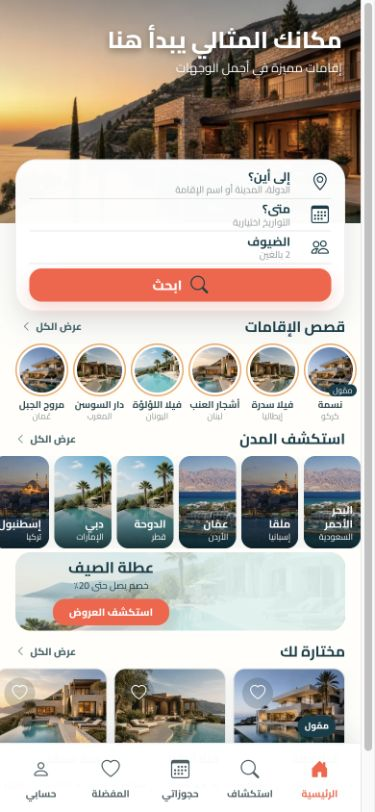
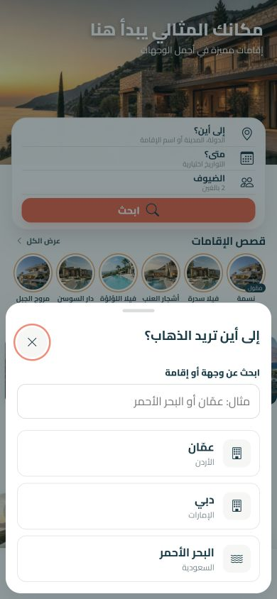
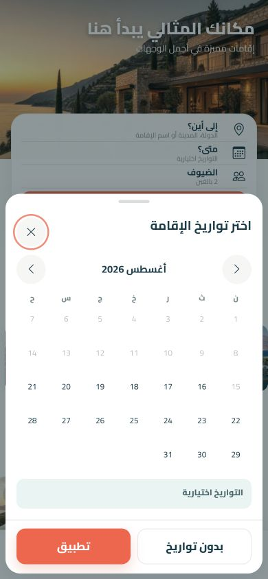
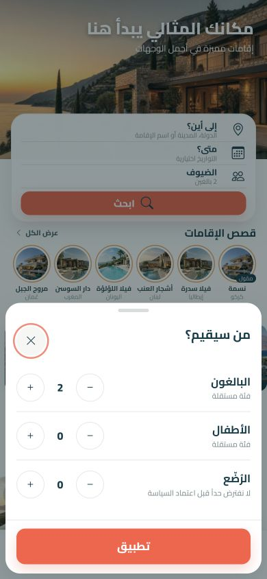
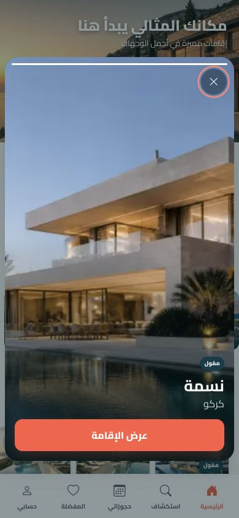

# Customer Mobile Home — UI/UX Audit

Date: 2026-08-16  
Viewport: 390 × 844  
Scope: Home discovery screen, destination picker, date-range picker, guest picker, and sponsored story viewer.

## Executive summary

The mobile home page has a strong visual foundation: the theme is consistent with the customer web experience, the discovery flow does not force a booking type or dates, guest categories are separated, and the page uses a clear mobile hierarchy. The main weakness is over-compression. Search rows, labels, property cards, and several controls are smaller than a comfortable mobile reading/tapping size. The story viewer also needs clearer navigation and corrected semantics. Finally, sponsored content should be separated from personalized organic recommendations, not only labeled inside the same section.

Overall UI/UX health: **7.5/10 — strong direction, needs interaction and readability refinement before production.**

## Experience walkthrough

### 1. Initial discovery screen — Good foundation, too dense

What works:

- Strong image-led hero and consistent coral/teal theme.
- Search is the dominant task and keeps destination and dates optional.
- Circular stories, destination exploration, campaign, recommendations, and stable bottom navigation establish a useful discovery hierarchy.
- The page uses semantic headings, a main landmark, skip link, image alternatives, lazy-loaded below-fold images, and an active bottom-navigation state.

Issues:

- The interface compresses too much content into the first viewport. Search labels, story metadata, city labels, campaign copy, and property metadata become difficult to scan.
- Search rows use a 2rem minimum height and the search CTA uses roughly 2.15rem; the favorite control is 2rem. These are below a comfortable mobile touch target.
- Recommendation cards use 34% rail width, making property names, rating, location, and price compete in a very small area.
- Several destination cards reuse images from unrelated cities, weakening location recognition and trust.
- The Favorites bottom-navigation item points to `#`, unlike property favorites, which invoke the sign-in flow.

### 2. Destination sheet — Clear and focused, missing useful states

What works:

- The sheet preserves the home context and makes destination optional.
- Search is labeled, recommended destinations are large rows, and the native dialog supplies a clear modal boundary.

Issues:

- The close control is visually as prominent as a primary action; it should be neutral.
- The sheet lacks a visible current-selection state when reopened.
- Add recent searches and, where permitted, nearby/current-location discovery.
- Define loading, no-results, and empty-search states before connecting live data.

### 3. Date-range sheet — Correct business behavior, unclear range selection

What works:

- A full calendar is used and `بدون تواريخ` correctly preserves flexible discovery.
- Month navigation and individual dates have accessible names.

Issues:

- The sheet does not clearly teach the two-step interaction: first choose arrival, then departure.
- Add persistent `الوصول` and `المغادرة` fields/chips above the month and reflect the active selection step.
- The current summary only says dates are optional; it should visibly update after the first and second selections.
- Calendar dates and one-letter weekday headings are visually small. Increase touch area and strengthen scanability without forcing a date.
- The Apply action should clearly reflect whether a valid range is selected or whether the existing flexible state is being retained.

### 4. Guest sheet — Correct category model, copy needs cleanup

What works:

- Adults, children, and infants are separate, matching the approved discovery model.
- Each increment/decrement action has a category-specific accessible label.

Issues:

- `فئة مستقلة` does not help the customer make a decision.
- `لا نفترض حداً قبل اعتماد السياسة` is internal product language and should not appear in production UI. Omit it until approved age/capacity guidance exists, or show approved localized guidance later.
- Counter buttons are about 2.55rem and should be enlarged to a comfortable mobile target.
- Make disabled decrement states unmistakable visually and programmatically.

### 5. Sponsored story viewer — Attractive, but navigation is hidden

What works:

- The property image is immersive, the sponsorship label is explicit, and the CTA is clear.
- Dialog, close, previous, and next controls have accessible names.

Issues:

- Previous/next controls are transparent 42% tap zones. Users cannot discover them and may trigger them accidentally. Add subtle visible edge controls or first-use hints, plus swipe navigation that maps correctly in RTL and LTR.
- The single full progress bar suggests timed auto-advance, but the current behavior is manual. Use segmented position indicators or remove the timing metaphor.
- Announce story position such as `1 من 6` and expose title changes through an appropriate live region.
- Story buttons currently set `role="listitem"` directly on `<button>`, replacing the native button role. Wrap buttons in list items or remove the overriding role.
- On mobile, use a true full-screen/safe-area viewer rather than leaving the underlying bottom navigation visually present around the dialog.
- If timed advance is added later, include pause/resume and respect reduced-motion preferences.

## Prioritized recommendations

### Priority 1 — production blockers for UX quality

1. **Separate sponsored and personalized content.** A `ممّول` property currently appears inside `مختارة لك`. Keep sponsored inventory in its own clearly labeled rail/slot and keep personalized organic recommendations separate.
2. **Fix story semantics and navigation.** Preserve button semantics, add visible navigation/swipe support, show position, and align the progress UI with actual behavior.
3. **Increase mobile readability and tap comfort.** Target at least 44 × 44 CSS pixels for primary touch controls; raise small metadata text; let the page scroll instead of compressing all content into the first viewport.
4. **Clarify date-range selection.** Add arrival/departure state, selection guidance, and a clear valid-range state while preserving `بدون تواريخ`.
5. **Give property recommendations more space.** Show fewer, larger cards per viewport so name, location, rating, and starting price can be read at a glance.

### Priority 2 — trust and polish

6. Use unique, geographically accurate destination imagery for every city.
7. Replace internal guest-policy copy with approved customer-facing guidance or omit it.
8. Add destination selected, recent, loading, empty, and no-results states.
9. Make sheet close buttons visually neutral and reserve coral for conversion actions.
10. Make the campaign offer scannable and trustworthy with eligibility/context available from the offer destination page.
11. Route the Favorites tab consistently to its real screen or the same sign-in gate used by favorite buttons.

## Motion recommendations

- Use a restrained 180–240ms sheet slide/fade and keep the existing reduced-motion override.
- Add a small seen/unseen state transition to story rings.
- Use a short color/scale confirmation for favorite actions, with no animation under reduced-motion.
- Preserve scroll snapping and an edge peek for horizontal rails.
- Avoid hero parallax and aggressive story autoplay; they add motion and rendering cost without improving the booking task.

## Performance notes

The implementation already makes good choices: WebP sources, intrinsic image dimensions, lazy loading, a preloaded responsive hero, external CSS files, and a page-specific ES module. Preserve those choices. When replacing repeated city imagery, produce correctly cropped 640px WebP assets rather than loading larger originals. Consider reducing the Cairo request to only the weights actually used once typography is finalized.

## Accessibility evidence and limits

This review inspected the rendered 390 × 844 states and DOM semantics. Positive evidence includes the skip link, native dialogs, focus-visible styling, labeled controls, alternative image text, RTL direction, and reduced-motion CSS. It is not a full WCAG conformance audit: no screen-reader session, keyboard-only end-to-end pass, automated contrast calculation, or device-level touch testing was performed.

